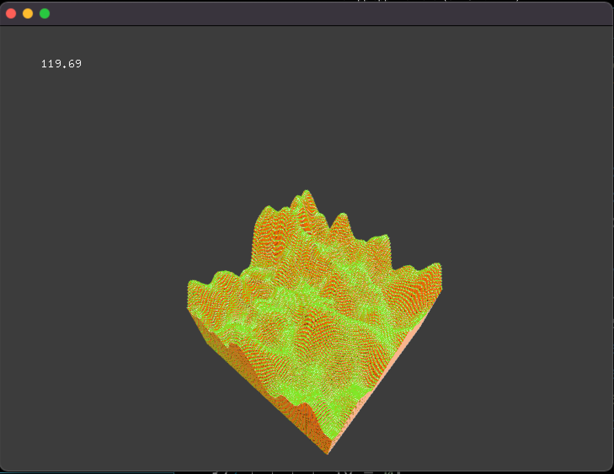

# ofBoxel
openFrameworksでボクセルの世界を描画するサンプルです。  
段階的に機能が実装されており、ポイントとなる変更のコミットにタグを貼っています。

## タグ
* basic         ofBoxによる実装
* opt1          インスタンシング
* opt1_tex      インスタンシング+テクスチャ1枚
* opt2          インスタンシング+テクスチャパック
* opt2_world    一旦座標直打ちでゲームっぽい画面の描画
* opt2_autogen  パーリンノイズを組み込んで地形生成
* controller    WASD+矢印での移動、マウスカーソルでブロックの選択